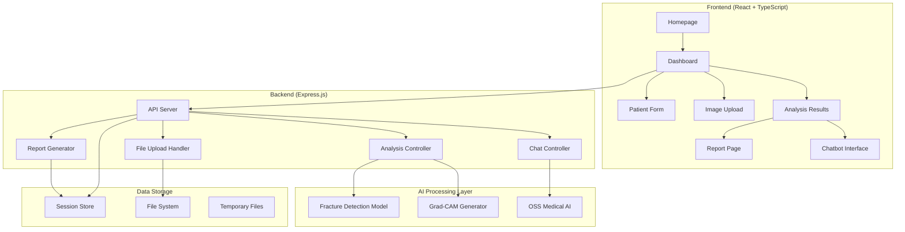

# Design Document

## Overview

The MedScan Pro system integration design focuses on creating a seamless connection between the React TypeScript frontend and Express.js backend to deliver a professional medical diagnostic platform. The system processes medical images through AI-powered fracture detection, generates comprehensive diagnostic reports, and provides interactive medical consultations through an OSS-powered chatbot.

## Architecture

### System Architecture Diagram



### Communication Flow

1. **Upload Flow**: Frontend → Multer → File System → Analysis Pipeline
2. **Analysis Flow**: Image Processing → AI Model → Grad-CAM → Report Generation
3. **Chat Flow**: User Message → OSS AI → Formatted Response → Frontend
4. **Download Flow**: Session Data → Report Generator → File Download

## Components and Interfaces

### Frontend Components

#### Core Application State
```typescript
interface AppState {
  showHomepage: boolean;
  currentView: 'dashboard' | 'report' | 'chatbot';
  patientData: PatientData;
  uploadedFiles: UploadedFile[];
  analysisResult: AnalysisResult | null;
  isAnalyzing: boolean;
  sessionId: string;
}
```

#### Enhanced Error Handling
```typescript
interface ErrorState {
  type: 'upload' | 'analysis' | 'chat' | 'download';
  message: string;
  details?: string;
  timestamp: Date;
}
```

#### Loading States
```typescript
interface LoadingStates {
  uploading: boolean;
  analyzing: boolean;
  chatting: boolean;
  downloading: boolean;
}
```

### Backend API Endpoints

#### File Upload Enhancement
- **Endpoint**: `POST /api/upload`
- **Enhancements**: File validation, size limits, type checking
- **Response**: Enhanced with validation results and preview URLs

#### Analysis Pipeline
- **Endpoint**: `POST /api/analyze`
- **Process**: File validation → AI processing → Report generation → Session storage
- **Response**: Comprehensive analysis with error handling

#### Chat Integration
- **Endpoint**: `POST /api/oss-chat`
- **Process**: Context preparation → OSS AI call → Response formatting
- **Features**: Model selection, conversation history, timeout handling

#### Report Download
- **Endpoint**: `GET /api/download/:sessionId`
- **Process**: Session retrieval → Report formatting → File generation
- **Features**: Custom filename, proper headers, error handling

### Data Models

#### Enhanced Patient Data
```typescript
interface PatientData {
  name?: string;
  age?: number;
  gender?: 'male' | 'female' | 'other';
  patientId?: string;
  symptoms?: string;
  clinicalNotes?: string;
  medicalHistory?: string;
  allergies?: string;
  currentMedications?: string;
}
```

#### Comprehensive Analysis Result
```typescript
interface AnalysisResult {
  success: boolean;
  sessionId: string;
  analysis: {
    fractureDetected: boolean;
    confidence: number;
    location: string;
    severity: 'mild' | 'moderate' | 'severe';
    pattern?: string;
    displacement?: string;
    gradCamPath: string;
    modelUsed: string;
    deviceUsed: string;
    processingTime: number;
    maxActivation: number;
    modelVersion: string;
  };
  vertexDescription: string;
  reportPath: string;
  timestamp: Date;
  error?: string;
}
```

#### Session Management
```typescript
interface SessionData {
  sessionId: string;
  patientData: PatientData;
  uploadedFiles: UploadedFile[];
  analysisResult: AnalysisResult;
  chatHistory: ChatMessage[];
  timestamp: Date;
  lastActivity: Date;
}
```

## Error Handling

### Frontend Error Management

#### Error Boundary Implementation
- Global error boundary for unhandled exceptions
- Component-level error boundaries for isolated failures
- User-friendly error messages with recovery options

#### Network Error Handling
- Retry mechanisms for failed requests
- Offline detection and graceful degradation
- Timeout handling with user feedback

#### Validation Errors
- Real-time form validation
- File type and size validation
- Clear error messaging with correction guidance

### Backend Error Management

#### API Error Responses
```typescript
interface APIError {
  success: false;
  error: {
    type: 'validation' | 'processing' | 'system' | 'timeout';
    message: string;
    details?: any;
    code: string;
  };
  timestamp: Date;
}
```

#### File Processing Errors
- Invalid file format handling
- Corrupted file detection
- Storage space management

#### AI Model Errors
- Model loading failures
- Processing timeouts
- Fallback response mechanisms

## Testing Strategy

### Frontend Testing

#### Unit Tests
- Component rendering tests
- State management tests
- Utility function tests
- API integration tests

#### Integration Tests
- User workflow tests
- Error scenario tests
- Performance tests

#### E2E Tests
- Complete diagnostic workflow
- Multi-user session handling
- Error recovery scenarios

### Backend Testing

#### API Tests
- Endpoint functionality tests
- Request/response validation
- Error handling tests
- Performance benchmarks

#### Integration Tests
- File upload and processing
- AI model integration
- Session management
- Database operations

#### Load Tests
- Concurrent user handling
- File processing under load
- Memory and CPU usage monitoring

### AI Model Testing

#### Accuracy Tests
- Model prediction validation
- Grad-CAM visualization verification
- Performance benchmarking

#### Integration Tests
- Python-Node.js communication
- Error propagation testing
- Timeout handling

## Performance Optimization

### Frontend Optimizations

#### Code Splitting
- Route-based code splitting
- Component lazy loading
- Dynamic imports for heavy components

#### Asset Optimization
- Image compression and lazy loading
- Bundle size optimization
- Caching strategies

#### State Management
- Efficient re-rendering prevention
- Memory leak prevention
- Optimized data structures

### Backend Optimizations

#### Request Processing
- Request queuing for analysis
- Concurrent processing limits
- Memory management for large files

#### Caching Strategy
- Session data caching
- Analysis result caching
- Static asset caching

#### Resource Management
- File cleanup procedures
- Memory usage monitoring
- Process management for AI models

## Security Considerations

### Data Protection
- Patient data encryption
- Secure file storage
- Session data protection

### API Security
- Request validation
- Rate limiting
- CORS configuration
- Input sanitization

### File Security
- File type validation
- Malware scanning
- Secure file paths
- Temporary file cleanup

## Deployment Architecture

### Development Environment
- Local development setup
- Hot reloading configuration
- Debug logging

### Production Environment
- Process management (PM2)
- Load balancing considerations
- Health monitoring
- Backup strategies

### Monitoring and Logging
- Application performance monitoring
- Error tracking and alerting
- User activity logging
- System health metrics